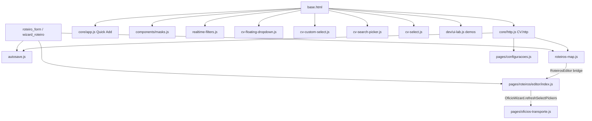
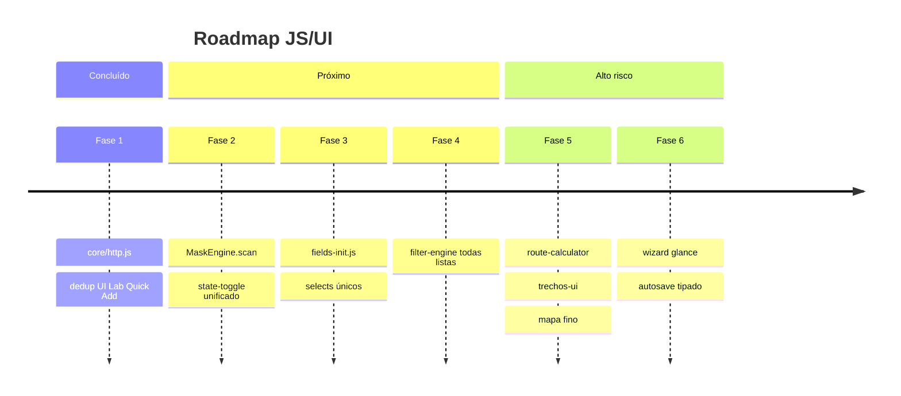

# Relatório Consolidado UI Lab × Produção + JS

**Data:** 2026-05-20  
**Branch:** `audit/ui-lab-js-consistencia`  
**Base Git:** `main` @ `9bd49fc` + cherry-pick dos relatórios `13956a8`, `84c2c19`  
**Fontes:** `docs/RELATORIO_UI_LAB_PARIDADE_GLOBAL.md`, `docs/RELATORIO_JS_CONSISTENCIA_GLOBAL.md`

---

## 1. Resumo executivo

### Estado geral

| Dimensão | Avaliação |
|----------|-----------|
| UI Lab × produção (visual/estrutura) | **Média-alta** em cadastros/listas; **média** em wizards e CSS de módulo |
| JavaScript | **Híbrido** — motores globais maduros em filtros/quick add; domínio roteiro **monolítico** |
| Tokens / CSS | **Parcial** — `tokens.css` + `theme.css` ok; vários CSS de módulo com `#hex`/`rgba` |
| Inline JS/CSS produção | **Baixo risco** — sem `<script>` inline em produção; inline style pontual no UI Lab (demos) |

### Riscos críticos (não mexidos nesta fase)

1. `pages/roteiros/editor/index.js` (~1390 linhas) + `roteiros-map.js` — motor de rotas/trechos.
2. Wizard de ofícios ainda em `app-page` / `btn btn-*` em massa.
3. Cinco famílias de select/picker sem unificação.
4. `_cv_icon` em `dev/ui_lab` ainda acoplado ao component `button.html` (se não migrado na main).
5. Suite de testes com falhas pré-existentes (cadastros + wizard).

### O que foi corrigido nesta branch

| Item | Arquivo(s) |
|------|------------|
| Fase 1 JS: `core/http.js` | `static/js/core/http.js` (novo) |
| HTTP em autosave / mapa / CEP | `autosave.js`, `roteiros-map.js`, `configuracoes.js` |
| `http.js` no bundle global | `templates/base.html` |
| Quick Add UI Lab → padrão global | `structures.html`, `lists.html`, `headers.html` |
| Remoção duplicação Quick Add no lab | `ui-lab.js` (só demos de botão) |
| Scripts select duplicados no lab | `dev/ui_lab/base.html` |
| Stub navegação lab (evita 404) | `ui-lab-navigation.js` |
| Contrato data attributes | `docs/DATA_ATTRIBUTES_JS.md` |
| Microcorreções UI (cherry-pick) | `wizard_assinaturas.html`, `termos/index.html`, `oficios-assinaturas-central.css` |

### O que não foi mexido

- `pages/roteiros/editor/index.js` (exceto consumo indireto via `roteiros-map` + `CV.http`).
- Wizard ofícios (shell, stepper, `wizard_actions.html`).
- Unificação selects/toggles/máscaras dinâmicas.
- Tokenização completa de `oficios-assinaturas-central.css`, `roteiros-list.css`.
- Migração massiva `btn` → `cv-btn`.
- Screenshots Playwright.

### Próxima fase recomendada

**Fase 2 JS:** `MaskEngine.scan(root)` + `state-toggle.js` unificado — branch `refactor/js-masks-toggles-fase2`.

---

## 2. UI Lab × Produção

| Área | Modelo UI Lab | Produção atual | Paridade | Arquivos | Risco | Ação tomada | Pendência |
|------|---------------|----------------|----------|----------|-------|-------------|-----------|
| Background / shell | `app-shell--ui-lab` | `app-shell` + `theme.css` | Alta | `base.html`, `ui-lab.css` | Baixo | Nenhuma | — |
| page-shell.css | Demo structures | `base.html` link global | Alta | `page-shell.css` | Baixo | Nenhuma | — |
| app-page legado | Demos antigas | wizards, placeholders, assinaturas | Média | `wizard_base.html`, `termos` (parcial) | Médio | termos: `cv-btn` (cherry-pick) | Migrar wizard |
| Cabeçalho de página | `headers.html` inline + alguns includes | `components/ui/headers/page_header.html` em CRUDs | Alta cadastros | `page_header.html` | Baixo | Nenhuma | Wizard header próprio |
| Header stepper | Demo wizard | `wizard_base` ainda legado | Baixa wizard | `wizard_base.html` | Alto | Nenhuma | Fase wizard shell |
| Structures standard | `structures.html` | `page_shell.html`, forms | Alta | `standard_*_page.html` | Baixo | Nenhuma | — |
| Quick Add | Inline demo | `list_page_quick_add` + `core/app.js` | Alta | `list_page_quick_add.html` | Baixo | Lab → `data-quick-add-*` | — |
| Buttons cv-btn | `buttons.html` | Misto `btn`/`cv-btn` | Média | `wizard_actions.html`, assinaturas | Médio | termos corrigido | Migração controlada |
| Lists / cards | `lists.html` | `main_list_card`, `list_page_*` | Alta | `main_list_card.html` | Baixo | Já tem `data-cv-filter-item` | — |
| Fields | `ui-lab-fields.css` inline | `form_field` → `field.html` | Média | `forms.css` | Médio | Nenhuma | Unificar pipeline |
| Selects | `selects_filters.html` | Globais em `base.html` | Alta funcional | `cv-*-select.js` | Médio | Removido dup no lab | Unificar motores |
| Toggles | `cv-state-button` demo | `field_action_button`, `card-toggle` | Média | `card-toggle.js` | Médio | Nenhuma | Fase 2 JS |
| Chips | `status.html` | `chip.html`, presenters | Alta | `chip.html` | Baixo | Nenhuma | — |
| CSS tokens | `tokens.css` | Módulos com hardcoded | Média | `oficios-assinaturas-central.css` | Médio | Erro assinaturas tokenizado (cherry-pick) | Tokenizar módulos |

---

## 3. Top 10 divergências visuais

| Problema | Arquivo | Gravidade | Correção segura | Fase |
|----------|---------|-----------|-----------------|------|
| Wizard ofício sem `page-shell--wizard` | `oficios/wizard_base.html` | Alta | Migrar shell + stepper | Wizard shell |
| `btn btn-primary` em wizard/assinaturas | `wizard_actions.html`, `wizard_documentos.html` | Média | Migrar por partial | Botões fase 2 UI |
| `#hex` / `rgba` em assinaturas | `oficios-assinaturas-central.css` | Média | Tokenizar por bloco | CSS tokens |
| `app-page` em placeholders | `planos_trabalho`, `ordens_servico`, etc. | Baixa | `page-shell--standard-simple` | Placeholders |
| UI Lab markup inline vs includes | `dev/ui_lab/*.html` | Baixa | Promover includes | Componentização lab |
| `ui-lab-cv-buttons.css` não linkado | `buttons.html` | Baixa | Linkar ou remover | Lab cleanup |
| Rota `/dev/ui-lab/cards/` errada | view ui_lab | Baixa | Corrigir view | Dev |
| `_cv_icon` fora de `components/icons` | `dev/ui_lab/_cv_icon.html` | Média | Mover ícone global | Icons |
| Inline style em demos lab | `selects_filters.html` | Baixa | Classes utilitárias | Lab only |
| `forms.css` vs `ui-lab-fields.css` duplicado | CSS | Média | Documentar fonte única | CSS refactor |

---

## 4. CSS e tokens

| Arquivo | Hardcoded encontrado | Token sugerido | Corrigido? | Motivo se não |
|---------|---------------------|----------------|------------|---------------|
| `oficios-assinaturas-central.css` | Muitos `#hex`, `rgba` | `--color-*`, `--space-*` | Parcial | Escopo grande; só erro card |
| `roteiros-list.css` | Cores layout cards | `--color-surface`, borders | Não | Fora escopo |
| `oficios.css` | Mistura legado | tokens existentes | Não | Acoplado `app-page` |
| `cv-buttons.css` | Poucos fixos | `--cv-btn-*` | Não | Já majoritariamente tokenizado |
| `page-shell.css` | Poucos | `--cv-shell-*` | Não | OK estrutural |
| `forms.css` | Alguns fixos | `--cv-field-*` | Não | Arquivo grande |
| `ui-lab-fields.css` | Demos | espelha forms | Não | Só lab |

---

## 5. Components

| Component | Status | Onde é usado | Onde deveria ser usado | Pendência |
|-----------|--------|--------------|------------------------|-----------|
| `page_header` | Produção | CRUDs, listas | Wizard ofícios | Wizard |
| `button.html` (cv-btn) | Produção parcial | termos, listas | wizard_actions, assinaturas | Migração |
| `field.html` | Produção | forms novos | todos forms | Unificar |
| `field_state_toggle` | Parcial | servidores/viaturas (outra branch?) | forms com RG | Verificar main |
| `main_list_card` | Produção | ofícios, roteiros | — | OK |
| `list_page_quick_add` | Produção | cargos, unidades, combustíveis | — | OK |
| `chip.html` | Produção | status, filtros | — | OK |
| `wizard_form_actions` | Parcial | wizards | todos wizards | URLs adapter |

---

## 6. JavaScript

| Área | Arquivos | Problema | Risco | Fase |
|------|----------|----------|-------|------|
| Rotas/trechos | `index.js`, `roteiros-map.js` | Monolito + paralelo | Crítico | 5 |
| HTTP/CSRF | vários | Duplicado | Médio | **1 (feito)** |
| Quick Add | `app.js`, `ui-lab.js` | Duplicado | Baixo | **1 (feito)** |
| Selects | 5 motores | Fragmentação | Alto | 3 |
| Máscaras | `masks.js` | Sem re-scan | Médio | 2 |
| Filtros | `realtime-filters.js` | OK | Baixo | 4 estender |
| Autosave | `autosave.js` | Globals | Médio | 6 |
| Wizard glance | `roteiros_wizard.js` | IDs fixos | Baixo | 6 |

---

## 7. Top 10 problemas JS

1. `pages/roteiros/editor/index.js` monolítico (~1390 linhas).
2. `roteiros-map.js` paralelo com bridge `window.RoteirosEditor`.
3. Módulos ES stub (`trechos.js`, `mapa.js`, …).
4. CSRF/fetch duplicados — **mitigado** com `CV.http` (Fase 1).
5. Quick Add duplicado no UI Lab — **corrigido** (Fase 1).
6. Cinco famílias select/picker.
7. Máscaras sem `scan(root)` após DOM dinâmico.
8. Globals `window.*` sem contrato formal.
9. IDs hardcoded no editor de roteiro.
10. Scripts select duplicados no UI Lab — **corrigido** (Fase 1).

---

## 8. Fase 1 JS — resultado

| Critério | Status |
|----------|--------|
| `core/http.js` criado | Sim |
| `window.CV.http` exportado | Sim |
| `base.html` carrega `http.js` | Sim |
| `roteiros-map.js` migrado | Sim (com fallback) |
| `autosave.js` migrado | Sim (com fallback) |
| `configuracoes.js` migrado | Sim (com fallback) |
| Quick Add deduplicado no lab | Sim |
| Scripts duplicados removidos do lab | Sim |
| `ui-lab-navigation.js` | Stub (nav ativa no servidor) |
| `index.js` | **Não alterado** |
| Smoke tests manuais | Documentados abaixo (não automatizados) |
| `docs/DATA_ATTRIBUTES_JS.md` | Criado |

### Smoke tests manuais (checklist)

- [ ] UI Lab structures/lists/headers: Quick Add abre/fecha sem erro de console.
- [ ] UI Lab selects_filters: selects não duplicam UI (verificar DOM).
- [ ] Configurações: CEP 8 dígitos preenche endereço.
- [ ] Roteiro: calcular rota no mapa (preview e persistido).
- [ ] Autosave roteiro: alterar campo → status salvo; rascunho vazio não criar.

---

## 9. Roadmap por fases

### Fase 1 — HTTP + dedup lab ✅ (esta branch)

- **Branch:** `audit/ui-lab-js-consistencia`
- **Arquivos:** `core/http.js`, `base.html`, `autosave.js`, `roteiros-map.js`, `configuracoes.js`, `ui-lab.*`
- **Risco:** Baixo
- **Aceite:** Mesmos payloads/endpoints; CEP e mapa funcionam
- **Testes:** `manage.py check`; smoke manual

### Fase 2 — Máscaras + toggles

- **Branch:** `refactor/js-masks-toggles-fase2`
- **Arquivos:** `masks.js`, `state-toggle.js`, `viatura-motorista-fixo.js` → fundir
- **Risco:** Baixo-médio
- **Aceite:** Quick add e forms reabertos mascarados; RG/motorista iguais

### Fase 3 — fields-init

- **Branch:** `refactor/js-fields-init-fase3`
- **Arquivos:** `fields-init.js`, `OficioWizard.refresh*`
- **Risco:** Médio
- **Aceite:** Pickers após partial load sem duplicar

### Fase 4 — filter-engine

- **Branch:** `refactor/js-filters-fase4`
- **Arquivos:** `realtime-filters.js` rename/extend
- **Risco:** Baixo
- **Aceite:** Todas listas/cards com scope + empty state

### Fase 5 — rotas/trechos

- **Branch:** `refactor/js-routes-fase5`
- **Arquivos:** extrair de `index.js`, `roteiros-map.js`
- **Risco:** **Alto**
- **Aceite:** Paridade km/tempo/trechos roteiro avulso = ofício

### Fase 6 — wizard/autosave

- **Branch:** `refactor/js-wizard-autosave-fase6`
- **Arquivos:** `roteiros_wizard.js`, `autosave.js` hooks
- **Risco:** Médio
- **Aceite:** Sem rascunho vazio; glance isolado

---

## 10. Mermaid — arquitetura JS atual



---

## 11. Mermaid — roadmap



---

## 12. Screenshots diff

**Não executado nesta fase.**

Comando recomendado (quando Playwright estiver configurado):

```bash
python manage.py runserver
# Playwright ou ferramenta interna contra:
# /dev/ui-lab/structures/
# /dev/ui-lab/lists/
# /cadastros/configuracao/
# /roteiros/<id>/editar/
```

Rotas prioritárias: UI Lab structures, lista cargos, configuração, editor roteiro.

---

## 13. Testes

| Comando | Resultado |
|---------|-----------|
| `python manage.py check` | **OK** — 0 issues |
| `python manage.py test` | **428 testes** em ~46s — **6 failures, 8 errors, 1 skipped** |

### Detalhe (pré-existentes — não causados por Fase 1 JS)

| Tipo | Módulo / teste |
|------|----------------|
| ERROR (2) | `cadastros.tests.test_configuracoes.ApiConsultaCepTests` — mock `cadastros.views.requests` inexistente |
| ERROR (5) | `cadastros.tests.test_crud_unidade_cidade` — CRUD cidade/estado |
| ERROR (1) | `cadastros.tests.test_crud_cadastros_estrutura` — autenticação index |
| FAIL (5) | `cadastros.tests.test_crud_unidade_cidade` — unidades |
| FAIL (1) | `oficios.tests` — `test_get_novo_renderiza_wizard` |

Nenhuma falha apontou para `core/http.js`, `autosave.js` ou `roteiros-map.js`.

---

## 14. Arquivos alterados (esta branch)

- `docs/RELATORIO_PARIDADE_UI_JS_CONSOLIDADO.md` (novo)
- `docs/DATA_ATTRIBUTES_JS.md` (novo)
- `docs/RELATORIO_UI_LAB_PARIDADE_GLOBAL.md` (cherry-pick)
- `docs/RELATORIO_JS_CONSISTENCIA_GLOBAL.md` (cherry-pick)
- `static/js/core/http.js` (novo)
- `static/js/dev/ui-lab-navigation.js` (novo)
- `static/js/dev/ui-lab.js`
- `static/js/autosave.js`
- `static/js/roteiros-map.js`
- `static/js/pages/configuracoes.js`
- `templates/base.html`
- `templates/dev/ui_lab/base.html`
- `templates/dev/ui_lab/structures.html`
- `templates/dev/ui_lab/lists.html`
- `templates/dev/ui_lab/headers.html`
- (+ cherry-pick: `wizard_assinaturas.html`, `termos/index.html`, `oficios-assinaturas-central.css`)

---

## 15. Pendências finais

### Rápido

- Smoke manual UI Lab + CEP + mapa.
- Corrigir view `ui_lab_cards` → `cards.html`.
- Linkar ou remover `ui-lab-cv-buttons.css`.

### Médio

- Migrar placeholders para `page-shell--standard-simple`.
- `btn` → `cv-btn` em partials isolados (não wizard inteiro).
- Documentar matriz select vs picker.

### Grande / alto risco

- Wizard ofícios → `page-shell--wizard` + headers globais.
- Fase 5: extrair motor rotas de `index.js`.
- Tokenizar CSS de assinaturas/roteiros/ofícios por completo.

---

*Fim do relatório consolidado.*
